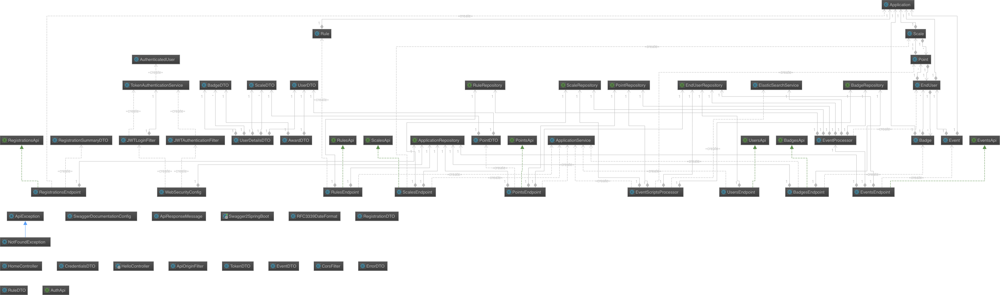

# Quaris

## A Gamification project by Henrik Akesson & Fabien Salathe

# Context
This platform was developed as a project for the Multi Tiered Applications course.
It's purpose is to offer a Gamification platform for other applications.

# Gamify your application now!
## Easy to use
Quaris is a REST API based platform. Interacting with it is done entirely through HTTP CRUD requests.

## Almost no configuration required
Quaris handles everything related to the gamification of your application, and the only thing you need to configure and run the application is to provide your MySQL root username and password in the file located at **Quaris/spring-server/src/main/resources/application.properties** (lines 26 and 27).

## No funny business - Quaris uses [JSON Web Tokens](https://jwt.io/) to authenticate requests
Except for registering new apps and authenticating, every CRUD request to Quaris must contain the JWT provided by the server in its header. (Header must include : **"Authorization": "[jwt given by server]"**)

## Requirements
Before getting started you'll need to have
- [Maven](https://maven.apache.org/download.cgi)
- [MySql Server](https://dev.mysql.com/downloads/windows/installer/5.7.html)
- [Java JDK 8](http://www.oracle.com/technetwork/java/javase/downloads/jdk8-downloads-2133151.html)

## Run the app
commands:
- **mvn clean**
- **mvn compile spring-boot:run**

## API documentation
The complete Quaris API documentation is available [here](https://bafs.github.io/Quaris/)

## Database structure

## Server UML
Check out how our server classes are structured, if you dare

## Tests
There are two ways to test the platform:
### Mocha/Chai tests
In order to run the tests you need:
- [Node](https://nodejs.org/en/)
- [npm](https://www.npmjs.com/)

API Testing is available through the Chai and mocha tests in the **Quaris\Quaris-tests\Quaris-tests\specifications\api** folder.

Run **npm install**, then run each file.

### Simple web app
Try out how quaris can gamify a simple application with our "country finding" app, where the user is prompted to pinpoint on a world map where specific countries are. You get it right, you get points. First you get the points, then you get the badges, then you get the power.

### Admin app
Want to gamify your application and define rules, scales and badges? Try our administrator app, located here: https://github.com/BafS/Quaris-backend-admin